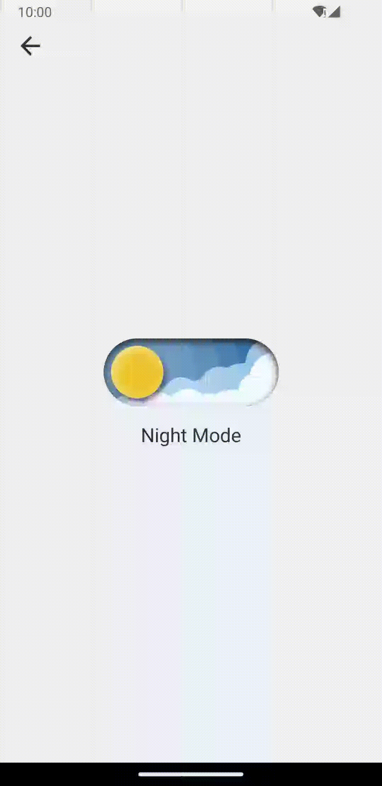

# DayNightSwitch

A nice switch to toogle day night mode.

## Preview



## Usage

Add it in your `settings.gradle` at the end of repositories:

```groovy
dependencyResolutionManagement {
  repositoriesMode.set(RepositoriesMode.FAIL_ON_PROJECT_REPOS)
  repositories {
    mavenCentral()
    maven { url 'https://www.jitpack.io' }
  }
}
```

Or add it in your `settings.gradle.kts` at the end of repositories:

```kotlin
dependencyResolutionManagement {
  repositoriesMode.set(RepositoriesMode.FAIL_ON_PROJECT_REPOS)
  repositories {
    mavenCentral()
    maven { url = uri("https://jitpack.io") }
  }
}
```

Add the dependency:

```kotlin
dependencies {
  implementation("com.github.DylanCaiCoding:DayNightSwitch:1.0.0")
}
```

Add `DayNightSwitch` in your layout:

```xml
<com.dylanc.daynightswitch.DayNightSwitch
  android:id="@+id/day_night_switch"
  android:layout_width="wrap_content"
  android:layout_height="wrap_content"/>
```

Toggle night mode:

```kotlin
dayNightSwitch.toggleNightModeOnAnimatorStart(this)
// dayNightSwitch.toggleNightModeOnAnimatorEnd(this)
```

You can listen the fraction changed to make smooth animations:

```kotlin
dayNightSwitch.setOnFractionChangedListener { fraction ->
  // ...
}
```

## License

```
Copyright (C) 2024 DylanCai

Licensed under the Apache License, Version 2.0 (the "License");
you may not use this file except in compliance with the License.
You may obtain a copy of the License at

   http://www.apache.org/licenses/LICENSE-2.0

Unless required by applicable law or agreed to in writing, software
distributed under the License is distributed on an "AS IS" BASIS,
WITHOUT WARRANTIES OR CONDITIONS OF ANY KIND, either express or implied.
See the License for the specific language governing permissions and
limitations under the License.
```
